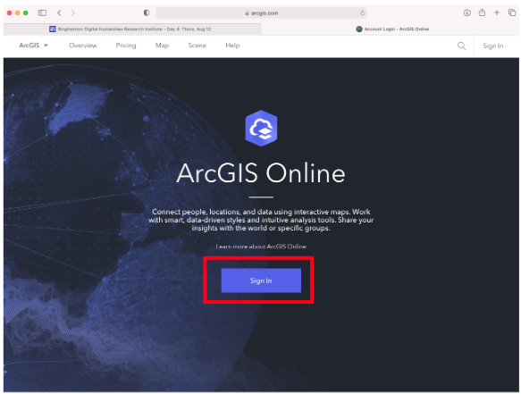
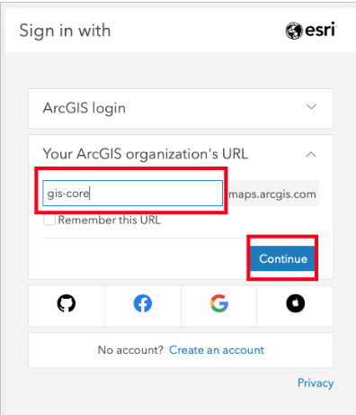
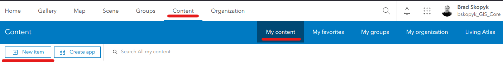
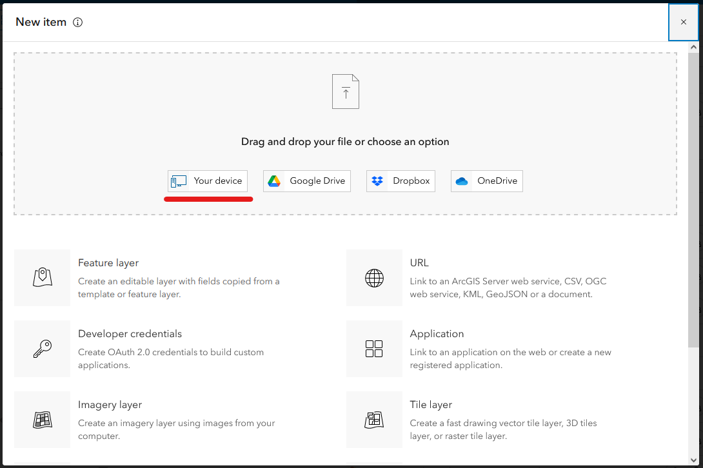
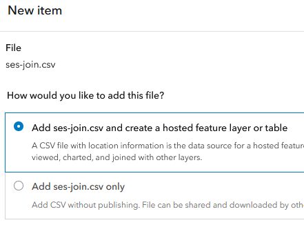
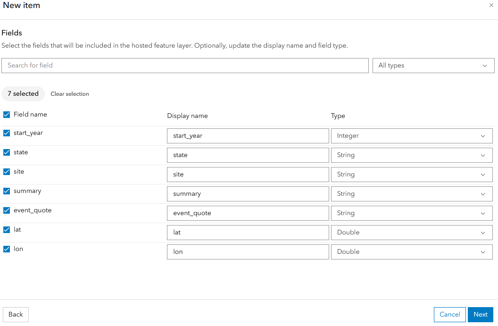
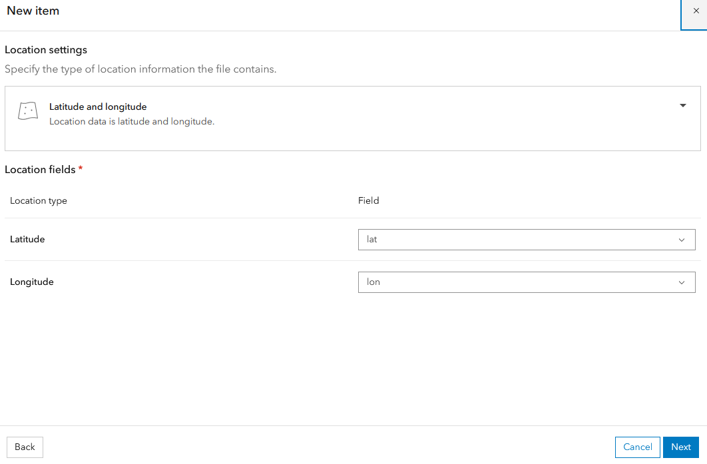
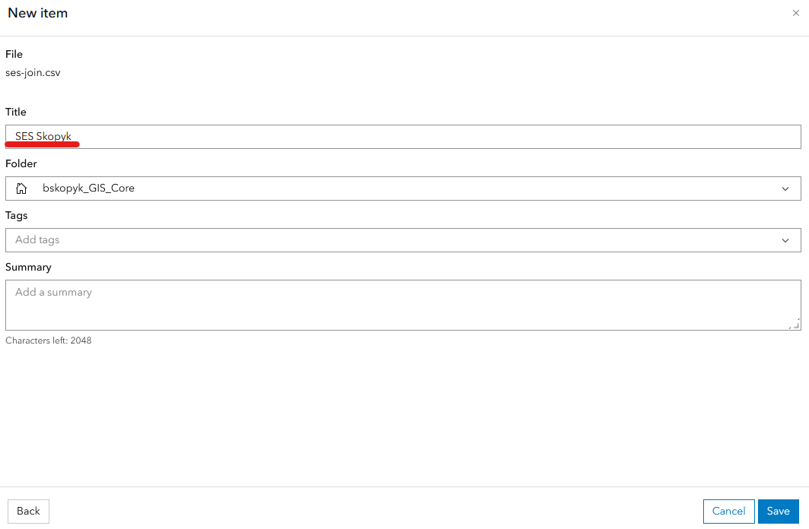
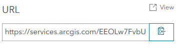
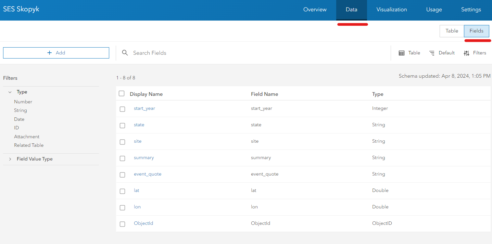

# Lesson M09 Javascript Mapping

This lesson explains how to create a javascript map for integration within a webpage. It provides instructions to:

- Create a GIS web service in ArcGIS Online;
- Add this web service to a Leaflet map within an html document;
- Customize the base map of web map;
- Set the map's default center and zoom level;
- Add popups for mapped GIS data;
- Add clustering;

No installations are required to complete this lesson, although you will need an ArcGIS Online account, which is free to members of the Binghamton University community.

## ArcGIS Online (AGOL)

There are many easy methods to plot x/y geographic coordinates in a map. We did this in week 6 (sql). Nevertheless, the workflow and technologies become more sophisticated and complex when we need to create maps that can be shared and hosted in a web environment. This is especially true for situations when we want to include dynamic and interactive maps within a simple webpage, such as within our gitpage.io 'git pages'.

In this lesson, we will learn how to created a hosted map service in ArcGIS Online, a web-based GIS service that is owned by ESRI and free to use for members of the Binghamton University community. A functional but limited version is also freely available to the public as a ArcGIS Public Account.

### Get an AGOL Account

1. Go to [ArcGIS Online](https://www.arcgis.com) and click Sign-in.



2. Type 'gis-core' in organization's URL and then click 'Continue'



3. Authenticate


That’s it! You now have an ArcGIS Online account.

### Create an AGOL Feature Layer

Let's create a feature layer for the SES dataset that we worked on in M06, using the joined csv table.

1. In AGOL, go to "Contents/My content". This will show the "+New Item" option in the top-left of the page.



2. This launches a window to select the origin of the file from which you wish to create a new item. The file will be the joined SES data, which you might already have on your machine or which is also [available in the git repo as "ses-join.csv"](m09-data/ses-join.csv). Select "Your device" and navigate to where you have the appropriate file (either your own or the one from github, which should be essentially the same).



3. Choose to add and create "a hosted feature layer or table". Then select 'Next'.



4. The next window gives you a view of the different fields and their data types. Make sure that your data has two fields for x/y (i.e. both a latitude and longitude field) and these are of the "Type" called "Double" (these are long decimal numbers to more than 13 place numbers). Then select 'Next'.



5. The next screen specifies how you want to create your GIS layer. You will choose 'Latitude and longitude'. Of interest, there is an option to create using "Addresses or place names", which is an address geocoding service when you text-based addresses. We have lat/long coordinates, so we choose the former. If your field names are recognizable as equivalent to latitude and longitude (e.g. something like 'lat' and 'lon'), it will automatically select the correct field. Ensure that it is properly identified. Then select 'Next'.



6. Finally, you will give the new item a name, which (in this classroom scenario with many persons replicating the same workflow) should include your surname in order to differentiate your layer from that of the other students. I called mine "SES Skopyk".



Because the csv file includes thousands of data points, it might take up to five minutes to get your layer ready.

Every AGOL item has an 'item description' page which is where you have all of the critical info and settings for this resource. There are multiple tabs, the default is 'overview'.

For this lesson, we want to take note of the service url (which is not the same as the item description url). The service URL is available at the bottom-right of the 'overview' tab.



NB: the endpoint of the service must be specified, meaning that you must go to the desired layer and then copy the service url.

We will want to copy this and then past it into our script element in the html doc that we will create below. We will come back to this shortly after we have create our html doc and script element.

Finally, in order for this to publicly viewable, we need to share this feature layer with everyone.

## Create html document

Because we are making a web page with a web map, we need an HTML document, the basis for essentially all web pages.

- Open VSCode
- Create a folder for your work, something like "M09-Leaflet-Work"
- Create a new html document named something like "skopyk-leaflet-lesson.html" (change 'skopyk' to your surname)
- add 'html', 'head', and 'body' elements:

```html
<!DOCTYPE html>
<html lang="en">

<head>
  <base target="_top">
  <meta charset="utf-8">
  <meta name="viewport" content="width=device-width, initial-scale=1">
</head>
<body>
  
</body>
</html>
```

### Add an introductory paragraph to introduce the map

We will add a 'div' with some basic styling, into which we will add a heading and a paragraph:

```html
    <div style="max-width: 600px; font-size:large">
        <h1>M09 Leaflet Lesson</h1>
        <p>Below you will find a map of more than 4,000 historical events for colonial Mexico, each indicating a possible manifestation of a social-ecological crisis or disturbance.</p>
    </div>
```

### Prepare html doc for the map

Put a div element with a certain id where you want your map to be. Make sure the map container has a defined height, for example by setting it in CSS or by adding inline style. This div will have an 'id' that will be referenced in the 'script', but it won't have any explicit content.

```html
 <div id="map" style="height: 180px"></div>
```

Now you’re ready to initialize the map and do some stuff with it.

## Leaflet

Leaflet is an open-source JavaScript library for mobile-friendly interactive maps. It is a web service that we can call into our scripts.

Leaflet is not a GIS server. Rather, it is a javascript library, meaning that it is a collection of scripts, in this case with mapping functionality. You access the js library by writing custom JS scripts to call upon and set parameters within the JS functions that are defined in the Leaflet JS library.

While html and css are not case sensitive, JavaScript is a case-sensitive language.

Here is the plan: We will call the service (and its css definitions) into the html head. Actually, we call the CSS before the service. Then we will start a 'script' element (where we write javascript). Scripts can be written in one of two places:

- Either directly within your HTML document within 'script' tags, or ...
- Within a separate JS document that is linked to the HTML doc
E.G. linking CSS doc to the HTML doc (i.e. …/script.js)

We will write scripts within our html document.

### Add Leaflet to html head

Include Leaflet CSS file in the head section of your document:

```html
 <link rel="stylesheet" href="https://unpkg.com/leaflet@1.9.4/dist/leaflet.css"
     integrity="sha256-p4NxAoJBhIIN+hmNHrzRCf9tD/miZyoHS5obTRR9BMY="
     crossorigin=""/>
```

Include Leaflet JavaScript file after Leaflet’s CSS (but still in the html head):

```html
 <!-- Make sure you put this AFTER Leaflet's CSS -->
 <script src="https://unpkg.com/leaflet@1.9.4/dist/leaflet.js"
     integrity="sha256-20nQCchB9co0qIjJZRGuk2/Z9VM+kNiyxNV1lvTlZBo="
     crossorigin=""></script>
```

### Esri Leaflet

ESRI has extended the leaflet library with it's own library. This is necessary in order to use the esri feature classes. Here is the [ESRI Leaflet Documentation](https://developers.arcgis.com/esri-leaflet/).

Let's add these services to the head:

```html
    <script src="https://unpkg.com/esri-leaflet@3.0.10/dist/esri-leaflet.js"></script>
    <script src="https://unpkg.com/esri-leaflet-vector@4.2.3/dist/esri-leaflet-vector.js"></script>
```

### Write 'script' for leaflet

Now we need to write some javascript. Start by adding a 'script' container:

```html
<script>

</script>
```

Inside of the script, let’s focus on Mexico by setting the view {setView([lat,lon],zoom 1-20)} to our chosen geographical coordinates and a zoom level.

```html
<script>
    var map = L.map('map', {maxZoom:18}).setView([23, -100], 5);
</script>
```

Now we add (directly under the 'var map' line but--as always--within the script container) a openstreetmap basemap by calling from the Leaflet JS library ("L.") the "tileLayer" function:

```js
    const tiles = L.tileLayer('https://tile.openstreetmap.org/{z}/{x}/{y}.png', {
      maxZoom: 19,
      attribution: '&copy; <a href="http://www.openstreetmap.org/copyright">OpenStreetMap</a>'
    }).addTo(map);
```

## Add Point Data from AGOL

At the end of our script, we will add using this template:

```js
L.esri.featureLayer({url: '[add the url here]'
}).addTo(map);
```

Create variable (var) for ‘sesdata’

```js
var sesdata = L.esri.featureLayer({
    url: 'https://services.arcgis.com/EEOLw7FvbUFCdg7T/arcgis/rest/services/SES_Skopyk/FeatureServer'
  }).addTo(map);
```

### Add Clustering

With over 4,000 points, performace will be an issue. So let's add a clustering method.

Clustering requires a special library extension that will need to be added to the head. Add this to the **html head**:

```html
  <!-- Load Leaflet MarkerCluster and Esri Leaflet Cluster from CDN -->
    <link rel="stylesheet" type="text/css"
      href="https://unpkg.com/leaflet.markercluster@1.5.0/dist/MarkerCluster.Default.css"
      integrity="sha512-6ZCLMiYwTeli2rVh3XAPxy3YoR5fVxGdH/pz+KMCzRY2M65Emgkw00Yqmhh8qLGeYQ3LbVZGdmOX9KUjSKr0TA=="
      crossorigin="">
    <link rel="stylesheet" type="text/css" href="https://unpkg.com/leaflet.markercluster@1.5.0/dist/MarkerCluster.css"
      integrity="sha512-mQ77VzAakzdpWdgfL/lM1ksNy89uFgibRQANsNneSTMD/bj0Y/8+94XMwYhnbzx8eki2hrbPpDm0vD0CiT2lcg=="
      crossorigin="">
    <script src="https://unpkg.com/leaflet.markercluster@1.5.0/dist/leaflet.markercluster.js"
      integrity="sha512-pWPELjRaw2ZdoT0PDi7iRpRlk1XX3rtnfejJ/HwskyojpHei+9hKpwdphC4yssNt4FM0TjMQOmMrk6ZYSn274w=="
      crossorigin=""></script>
    <script src="https://unpkg.com/esri-leaflet-cluster@3.0.1/dist/esri-leaflet-cluster.js"></script>
```

Now, to activate clustering, we only need to run the `featureLayer` function from within the `L.esri.Cluster` library instead of just the `L.esri` library. So change the `var sesdata` line by adding 'Cluster', as such:

```js
    var sesdata = L.esri.Cluster.featureLayer({
      url: 'https://services.arcgis.com/EEOLw7FvbUFCdg7T/arcgis/rest/services/SES_Skopyk/FeatureServer/0'
    }).addTo(map);
```

### Add Popups

A marker is a symbol (like a pin) that you see on a map that indicates that feature is mapped there. Markers can be used to show interactively attributes associated with that feature. We do this with 'pop-ups'.

Leaflet uses the `bindPopup` method with an associated function in order to show unique info for each feature, essentially calling back to the feature layer, asking for info about that feature, and then presenting info about that feature in an html format.

For our purposes, we would add something like this to our script:

```js
    sesdata.bindPopup(function (layer) {
      return L.Util.template(
        "<p>In <strong>{start_year}</strong>, at <strong>{site} ({state})</strong>,<br>the following was reported:</p><p><strong>{summary}</strong></p><p>{event_quote}</p>",
        layer.feature.properties
      );
    })
```

You can see that the content is presented using basic html and curly brackets for field values. The fields for a feature layer can be found on the item description page, following data/fields, as such:



## Final Thoughts

We have learned the basic about how to create and integrate online web services into an interactive map. Moreover, we can add such a map into a lightweight viewer embedded within any html page. This is a powerful tool.

Of course, there are dozens of key methods, in addition to what we have done here, that we must learn in order to present more sophisticated maps: e.g. different markers, layer controls, filter options, and time slider controls.

Nevertheless, keeping the map simple is an effective way to communicate your story to readers.

## Resources

[Leaflet Documentation](https://leafletjs.com/)

[ESRI Leaflet Documentation](https://developers.arcgis.com/esri-leaflet/)
